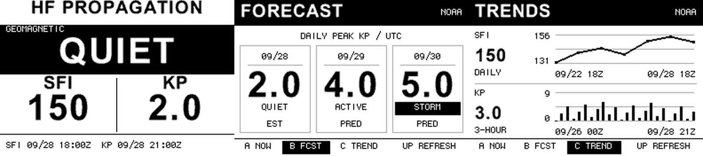
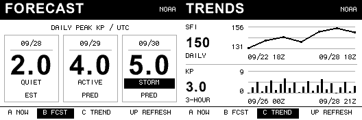

# HF Propagation

**Version 1.0.0** · [Changelog](CHANGELOG.md) · [GPL v3 License](LICENSE) · [Certificate notice](THIRD_PARTY_NOTICES.md)

A standalone **Badger 2350 / Badgeware v3** app. This directory is a self-contained project: it can be moved,
worked on, and packaged without the callsign app.

## License and author

Copyright (c) 2026 **Chris Parrish (KK4TSS)**.

HF Propagation is licensed under the **GNU General Public License, version 3 only**
(`GPL-3.0-only`). You may redistribute and modify it under those terms. Distributed
derivative versions must remain under GPL v3, with corresponding source provided
as the license requires. This software is provided without warranty; see
[LICENSE](LICENSE) for the complete terms.

## Screenshots

Desktop-rendered previews using illustrative readings, not live observations
or photographs of the badge.



Forecast and trends at native resolution:



## Install

Download `HF-Propagation.zip` from [GitHub Releases](https://github.com/KK4TSS/Badger-HF-Propagation/releases)
for the version you want.
Use the install ZIP asset rather than GitHub's automatically generated source ZIP.
Back up any custom `hf_settings.py` before updating.

1. Unzip `HF-Propagation.zip`.
2. Connect the Badger with a USB data cable and double-tap RESET.
3. Copy `hf_propagation` into the `apps` folder on the `Badger2350` disk.
4. Safely eject and open the new HF propagation entry in the launcher.

The app opens directly to HF PROPAGATION. It needs no callsign app files.
It uses your existing Badgeware `secrets.py` Wi-Fi settings; credentials are
not included or changed. Both apps can be installed together. The long-Down shortcut requires the
KK4TSS badge at `apps/kk4tss`; if it is missing, HF Propagation displays an
installation hint and stays open.

## Controls and readings

- **Up:** refresh observations, history and forecast from any screen.
- **Down:** cancel Wi-Fi connection or cancel between HTTP requests.
- **Hold Down for 0.8 seconds on current conditions, then release:** open the
  KK4TSS callsign badge. The shortcut is inactive on forecast and trends.
  A Down press used to cancel refresh must be released before starting a new hold.
- **Home:** return to the standard launcher.
- **A:** current conditions.
- **B:** forecast.
- **C:** trends.

The forecast shows the first three UTC dates with estimated or predicted Kp
periods in NOAA's feed. Each date card shows the highest Kp among the available periods
for that date (a partial day is possible). EST means estimated, PRED means
predicted, and EST/PRED means both contribute. Dates are shown explicitly so
saved forecasts cannot be mistaken for today's forecast. This is a geomagnetic
outlook, not a band-by-band HF prediction.

Trends shows up to seven daily SFI observations (the latest per UTC day) and
24 recent three-hour Kp observations. SFI uses a line chart and Kp uses bars,
positioned by actual observation time; the displayed start/end dates show the available coverage. SFI uses a
labeled automatic range; Kp uses a fixed 0–9 range. Refreshing fetches history
and forecast. Switching pages does not itself start Wi-Fi; a pending startup refresh can run
after the initial screen appears.

If only the forecast request fails, new observations and trends are kept and
any previous forecast stays visible with a failure label. If observation
refresh fails or is cancelled, the previous snapshot remains available.
`docs/images/screens-preview.png` shows all three screens with illustrative data.
`docs/images/forecast-trends-native.png` shows the forecast and trends screens at native size.
Forecast cards emphasize large peak readings, with storm conditions highlighted.
Trends places the latest values beside the charts; the active B/C tab is highlighted.

The large overview retains SFI, Kp, geomagnetic status, and UTC observation
timestamps. QUIET is below Kp 3, UNSETTLED starts at 3, ACTIVE at 4, and STORM
at 5. These global observations are context, not location-specific band forecasts.
Saved data appears immediately at startup, labeled SAVED. The app then makes
one automatic refresh attempt if readings are missing, Kp is at least three
hours old, or SFI is at least 36 hours old. Missing history/forecast, a failed
forecast, expired forecast dates, or an unset/backward clock also trigger one
startup attempt. Age is based on the observations' UTC timestamps, not simply
when the app last downloaded them. Up always refreshes manually.

A failed startup refresh retains the saved snapshot and shows FAILED; it waits
until the next three-hour interval to retry automatically. Down can cancel the pending
startup attempt or the request at the normal cancellation points. Saved values
stay available on all three pages. Always check the observation dates.
No sample readings are installed. The screenshots above use illustrative data.

Verified HTTPS requests have an 8-second connect/handshake/read budget per feed
(after system DNS resolution); bodies are limited to 256 KiB. Requests can
block ordinary controls during that budget.
Cancellation is checked during Wi-Fi connection and between requests.
On battery the app sleeps after 30 seconds without input; e-paper retains the
screen. While HF Propagation is the active app, an RTC alarm wakes it for an
automatic refresh every three hours (measured from the end of the last refresh
attempt, or app launch). It then sleeps again after 30 seconds. Failed or
cancelled requests retain saved readings and rearm the next three-hour attempt.
USB power keeps the app awake, with the same periodic refreshes. Up still
refreshes immediately. Home or the callsign shortcut clears the alarm: updates
do not run in the background while another app is open. An alarm wake reopens
the current-conditions page. Use the device's normal wake control for manual use.
Scheduled refresh requires your configured Wi-Fi network to be reachable.
The wake/sleep cycle still requires verification on physical hardware.

Snapshots are saved to `/state/hf-propagation.json`, outside the app folder,
so replacing `apps/hf_propagation` does not delete readings. Writes are flushed
and verified; a `.bak` snapshot protects against interrupted saves. Forecast and both histories are included.
If saving fails, new readings remain visible but the screen explicitly says
NOT SAVED (UNSAVED on B/C). A firmware erase can still remove saved state.

## Rear condition lights

After a successful observation refresh or an A/B/C/Down press, the four rear
lights briefly show the current Kp condition. Up starts a refresh and shows the
lights after success. A failed or cancelled refresh leaves them off.

| Condition | Light display |
|---|---|
| Quiet (Kp below 3) | One steady light |
| Unsettled (Kp 3–3.9) | Two steady lights |
| Active (Kp 4–4.9) | Three steady lights |
| Storm (Kp 5 or higher) | Four lights flashing slowly |

Defaults are 1.5 seconds at 50% brightness, with storm lights alternating
on/off every half second. Screen refreshes pause the lights, then resume
the remaining display time. Lights turn off before network requests, sleep and exit. They do not keep the badge awake. No readings means
no light display. By default, Kp readings at least three hours old, timestamps
more than five minutes ahead, or an unset clock also leave the lights off.

Edit `hf_propagation/hf_settings.py` and restart the app to customize:

| Setting | Default | Purpose |
|---|---|---|
| `LIGHTS_ENABLED` | `True` | Enable or disable all condition lights |
| `LIGHTS_ON_REFRESH` | `True` | Display after successful observation refreshes |
| `LIGHTS_ON_BUTTON` | `True` | Display after A/B/C/Down presses |
| `LIGHTS_BRIGHTNESS` | `0.50` | Brightness from 0.0 to 1.0 |
| `LIGHTS_DURATION_MS` | `1500` | Display length, limited to 0–30000 milliseconds |
| `LIGHTS_STORM_FLASH` | `True` | Flash for storms; `False` gives steady lights |
| `LIGHTS_FLASH_MS` | `500` | Duration of each on/off phase; minimum 100 ms |
| `LIGHTS_FRESH_ONLY` | `True` | Require fresh Kp and a set clock; `False` allows saved older readings |

Another eligible press restarts the short display. Home exits the app; holding
Down on current conditions turns the lights off when switching to the badge.

## Repository layout

```text
.github/          GitHub Actions workflows and issue templates
hf_propagation/   Installable app, icon and required bitmap glyphs
docs/images/     Screenshots embedded in this README
docs/artwork/    Original icon artwork for future edits
tests/           Desktop automated tests
tools/           Install packaging and release-note preparation
```

The repository root contains `README.md`, `LICENSE`, `CHANGELOG.md`, `VERSION`
and `.gitignore`. Keep the complete `hf_propagation/type/` directory: those PNGs
are runtime assets. Source artwork and screenshots belong in Git; generated ZIPs,
Python caches, device state and credentials do not. Only copy `hf_propagation/`
to the badge's `apps` folder.

## Develop independently

### HTTPS and device clock

Downloads validate NOAA's certificate chain and hostname using the bundled
`hf_propagation/amazon-root-ca-1.der`. Copy this file along with all app files.
There is no HTTP downgrade or unverified-TLS fallback; redirects are rejected.
A future change in NOAA's CA may require an app/certificate update.

The app checks the bundled certificate's expiry on startup and once per minute
while running, without needing Wi-Fi. Starting 90 days before **January 17,
2038 (UTC)**, a persistent footer on all three pages shows `CA EXPIRES
2038-01-17` and `UPDATE HF APP`. At expiry it changes to `CA EXPIRED`.
Install an updated HF app containing a renewed trust certificate when warned.
The reminder temporarily replaces the page footer; all buttons still work.
It requires a correct device clock and cannot display while another app is
running. An unset clock does not produce a misleading expiry warning; fetching
still reports `SET CLOCK`. When replacing the certificate, update its expiry
in `hf_certificate.py`; a desktop test checks it against the actual DER file.
The certificate has separate attribution and license terms in
[THIRD_PARTY_NOTICES.md](THIRD_PARTY_NOTICES.md).

Certificate validation requires an accurate UTC clock. If the screen says
SET CLOCK, set the badge's UTC time using your device setup tools; for example,
with MicroPython's `mpremote` installed and the device connected over USB,
`mpremote rtc --set` copies the computer's time to its RTC. Restart the app
and press Up. Firmware which cannot verify certificates must be updated; the
app will retain saved readings and show TLS ERROR instead of fetching insecurely.
TLS ERROR can also mean an incorrect clock, missing/changed CA, or failed TLS
handshake. CANCELLED means you stopped the refresh, not that Wi-Fi is offline.

### Settings

Edit `hf_propagation/hf_settings.py` (on the device,
`apps/hf_propagation/hf_settings.py`) and restart the app to apply changes.
All configurable runtime values are collected there: refresh interval, idle
sleep, shortcut hold duration, battery polling, network timeouts, freshness
limits, history lengths, feed URLs and storage/shortcut paths. Defaults preserve
the behavior described above. Timing names include their units; use positive
values and whole hours from 1 to 23 for `REFRESH_HOURS`.
Keep a copy of your settings before replacing the app during an update.
Wi-Fi credentials remain in Badgeware's `secrets.py`. Display geometry, NOAA
data-format constraints and standard Kp classifications remain part of the code.

- `hf_propagation/__init__.py`: entry point, controls, refresh and sleep.
- `hf_propagation/hf_settings.py`: editable runtime configuration.
- `hf_propagation/hf_data.py`: NOAA feeds, parsing and saved observations.
- `hf_propagation/hf_screen.py`: current conditions, forecast, trend charts and labels.
- `hf_propagation/hf_type.py`: bundled smooth bitmap lettering.

Additional screens can be developed in the screen module independently of the
callsign badge. The current page stays selected after refresh.

Desktop checks do not verify the device's Wi-Fi/TLS, sleep, launcher or e-paper
behavior. Those still need a physical-device check.

## Sources

- https://services.swpc.noaa.gov/json/f107_cm_flux.json
- https://services.swpc.noaa.gov/products/noaa-planetary-k-index.json
- https://services.swpc.noaa.gov/products/noaa-planetary-k-index-forecast.json
- https://github.com/pimoroni/badger2350

## Opening speed

The standalone app opens directly from the launcher without the old embedded
page's 800 ms hold. Smooth letters now use small PNG glyphs cached after first
use, replacing thousands of Python rectangle calls. Copy the complete app folder,
including `type`. Opening displays saved observations first, followed by a refresh
if they are stale or the app woke from its scheduled alarm. Up explicitly
refreshes. The panel still has its normal physical refresh time.
Actual speed needs verification on the device.

## Reliability checks

Saved observations are validated and numeric strings are normalized before
rendering. Invalid core readings are discarded; malformed optional history or
forecast entries are skipped without losing valid current readings. Calendar
dates, ranges and finite numbers are checked before use.

The long-Down shortcut verifies that Badgeware saved the destination before
resetting. If switching fails or the badge app is missing, a footer message
appears while the saved/offline status remains intact. The next button press
clears that message.

## Battery indicator

A small upper-right battery shows four charge bars; a lightning mark means
charging. The estimate comes from the badge battery-voltage API. While awake,
it checks once per minute and refreshes the screen only when the bars or charging
state change. Sleeping e-paper retains the last reading. A dash means the battery
reading is unavailable.

## Troubleshooting

| Symptom | What to check |
| --- | --- |
| App missing from launcher or will not open | Use Badger 2350 with Badgeware v3. Copy the entire `hf_propagation` folder directly into `apps`, not a nested ZIP folder. Safely eject and restart. |
| Missing letters or startup errors about assets | Copy all files, including `hf_propagation/type` and `icon.png`. Reinstall the complete folder from the install ZIP. |
| FAILED, no readings, or refresh fails | Check the existing Badgeware `secrets.py` Wi-Fi configuration and that its network is reachable. Press Up to retry. Saved readings remain available; inspect their UTC timestamps. |
| CANCELLED | You stopped the refresh; previous readings remain. Press Up to retry. |
| SET CLOCK or TLS ERROR | Check the device UTC clock, bundled CA file and firmware TLS support. No insecure fallback is used. |
| Forecast failure while current readings update | The forecast feed can fail separately. Previous forecast cards remain visible with a failure label. Press Up to retry and check the displayed dates. |
| SAVED data or unexpected age labels | SAVED means the snapshot was loaded from storage. Check observation dates and the device clock. Up requests fresh data; switching pages alone does not. |
| NOT SAVED or UNSAVED | Download succeeded but persistence failed. Check device free space and that `/state` is writable. Back up `/state/hf-propagation.json` and its `.bak` before attempting state recovery. |
| Buttons temporarily unresponsive during refresh | Network operations can block during the per-feed budget (8 seconds by default); system DNS resolution is outside that budget. Down cancellation is handled during Wi-Fi connection and between requests. |
| No scheduled refresh while another app is open | Scheduling runs only while HF Propagation is active. Home and the callsign shortcut clear its alarm. Keep Wi-Fi reachable; physical RTC wake/sleep still needs hardware verification. |
| Long-Down shortcut does not open the badge | Install the separate KK4TSS app at `apps/kk4tss`. Hold Down on current conditions for 0.8 seconds, then release. The shortcut is inactive on B/C. |
| Battery icon shows a dash | The badge battery API did not supply a reading. Check firmware compatibility; the last e-paper reading also remains visible during sleep. |

If the problem persists, open a **Bug report** under Issues with the app version,
firmware version, steps, exact message, and USB/battery state. Never post Wi-Fi
credentials or your `secrets.py`.

## 
